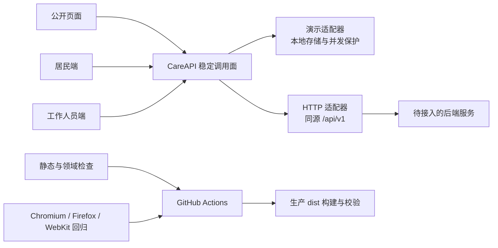

# 颐和 · 智慧康养

[](https://github.com/qiyuhuating/yihe-health/actions/workflows/frontend-checks.yml)

面向社区照护场景的原生 HTML、CSS、JavaScript 前端项目，包含公开站点、居民端和工作人员管理端。项目提供本地演示模式与面向同源服务的 HTTP 适配层。

**在线体验：** [GitHub Pages 演示站](https://qiyuhuating.github.io/yihe-health/) · [工作人员管理端](https://qiyuhuating.github.io/yihe-health/管理端.html) · [v0.1.0 发布说明](https://github.com/qiyuhuating/yihe-health/releases/tag/v0.1.0)

## 项目亮点

- **双端业务流程：** 居民健康信息、用药反馈、工作人员预警工作台与事件处置。
- **风险事件状态流转：** 覆盖接单、处理中、解决、误报和升级，并保留操作历史。
- **并发与本地一致性：** 演示数据通过 Web Locks 串行写入、Revision 检查和跨标签同步；冲突或存储失败不会静默覆盖。
- **后端接入准备：** 页面通过稳定调用面访问 HTTP 适配层，统一处理会话、CSRF、超时、错误状态和快照校验。
- **可验证的交付：** 静态规则检查、Node 领域测试、46 项浏览器回归测试，以及 Chromium、Firefox、WebKit 三浏览器 CI。
- **独立生产构建：** CI 构建并检查 HTTP-only 的 `dist/` 静态包；GitHub Pages 当前展示演示模式。

## 架构



## 技术特点

- 无前端框架迁移或第三方运行时依赖。
- 演示模式使用虚构数据；写入前后校验数据结构，存储失败时保留原记录。
- HTTP 模式不会在网络失败时回退到演示数据，也不在浏览器中保存服务端密钥。
- 前端提供 API 契约与适配层；认证授权、持久化、事务和通知仍由后端负责。

## 本地运行与检查

需要 Node.js 18+ 和 Python 3。在仓库根目录执行：

```sh
npm --prefix docs run check
npm --prefix docs run test:domain
npm --prefix docs run build
```

开发演示可通过本地静态 HTTP 服务打开 `docs/`。生产构建生成到 `docs/dist/`。

## 文件说明

| 文件 | 职责 |
| --- | --- |
| [backend/service.py](backend/service.py) | 提供 Python/SQLite API，处理会话、居民版本冲突、告警流转、设备输入、用药记录与审计。 |
| [backend/README.md](backend/README.md) | 说明后端依赖、数据库初始化、启动方式、配置项和部署边界。 |
| [backend/tests/test_service.py](backend/tests/test_service.py) | 验证后端接口、权限、状态机、并发版本和幂等行为。 |
| [docs/index.html](docs/index.html) | 居民健康端入口，呈现健康信息并加载前端运行配置与会话模块。 |
| [docs/home.html](docs/home.html) | 社区服务介绍页，说明居家健康监护与照护服务流程。 |
| [docs/脚本/care-api.js](docs/脚本/care-api.js) | 实现本地演示适配器，供前端演示业务流程和状态变化。 |
| [docs/脚本/care-http-adapter.js](docs/脚本/care-http-adapter.js) | 将前端领域操作映射到后端 HTTP 接口，并处理响应和业务错误。 |
| [docs/脚本/care-transport.js](docs/脚本/care-transport.js) | 统一发送同源 JSON 请求，处理超时、CSRF、幂等键和网络错误。 |
| [docs/脚本/care-runtime-config.js](docs/脚本/care-runtime-config.js) | 为页面提供运行模式及 API 基础路径等配置。 |
| [docs/数据/residents.js](docs/数据/residents.js) | 提供演示模式使用的虚构居民资料，不作为生产数据源。 |
| [docs/数据/schema.js](docs/数据/schema.js) | 定义并校验前端演示数据结构，阻止不符合预期的数据进入存储流程。 |
| [docs/package.json](docs/package.json) | 声明前端检查、领域测试、生产构建和浏览器测试命令。 |
| [.github/workflows/frontend-checks.yml](.github/workflows/frontend-checks.yml) | 在 GitHub Actions 中运行后端测试、前端静态检查、生产构建和浏览器回归。 |

## 目录

| 路径 | 内容 |
| --- | --- |
| `docs/样式/` | 居民端、管理端和公开页面使用的样式表。 |
| `docs/测试/` | 前端静态检查、领域测试和浏览器回归用例。 |
| `docs/工具/` | 前端构建、质量检查和本地测试辅助脚本。 |
| `docs/文档/` | 系统架构、前端交接、后端接入与发布手册。 |

## 当前边界

这是**前端 Demo 与单社区 HTTP/SQLite 后端基线**。仓库已包含可运行的服务端与合成数据联调测试；生产数据、正式设备、短信投递、TLS 与运营部署仍需配置和验收。

## 后续路线

1. 按[后端接入说明](docs/文档/handoff/backend-integration.md)实现服务端契约并完成联调。
2. 在真实接口环境验证认证、权限、版本冲突与异常恢复。
3. 按[发布手册](docs/文档/handoff/release.md)部署并验证生产构建。

更多细节见[系统架构](docs/文档/architecture.md)和[前端交接说明](docs/文档/handoff/frontend.md)。


## 最小后端

现提供单社区 Python/SQLite API，包含服务端会话、居民版本比较、信号与事件状态机、设备输入、用药、审计及通知假实现。运行、测试与部署边界见 [backend/README.md](backend/README.md)。静态 GitHub Pages 仍是 Demo；运行真实 HTTP 需要同源后端。
